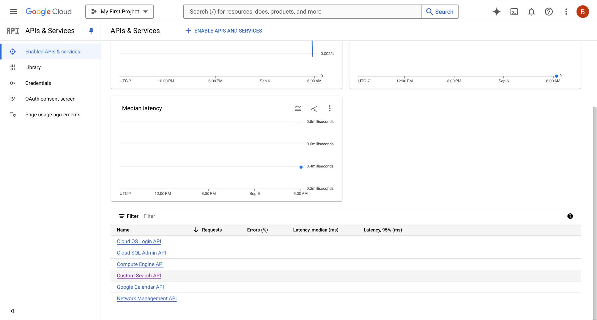
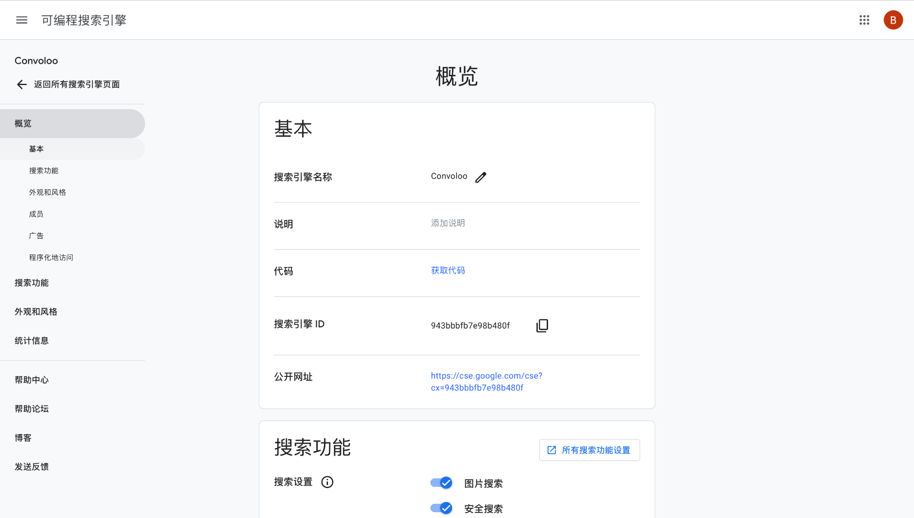

### **Integrating Web Searching in Medical Assistant Chatbot Using Google Custom Search JSON API**

#### **I. Introduction**
This report details the integration of a custom web search feature into a medical assistant chatbot, leveraging Google's Custom Search JSON API. This enhancement aims to improve the chatbot's functionality by providing direct access to web-based medical information.

#### **II. Configuration of Google Custom Search JSON API**
- **API Setup**:
  - An API key is obtained from the Google Developer Console to authenticate requests.
  - A Custom Search Engine (CSE) is created, configured to search across specific medical web resources.

#### **III. System Architecture**
- **Overview**:
  - The chatbot is designed using FastAPI and integrates Google's Custom Search JSON API for handling web search queries.
- **Components**:
  - **FastAPI**: Serves as the backend framework.
  - **Google Custom Search JSON API**: Manages web search queries.

#### **IV. Setting Up the Custom Search Engine**
- **Creating the Search Engine**:
  - Navigate to the Google Custom Search control panel.
  - Configure the search engine to focus on medical websites for more relevant results.
- **Obtaining the Search Engine ID and API Key**:
  - Search Engine ID and API Key are essential for integrating the search functionality into the chatbot.

#### **V. Implementation Steps**
```python
def google_custom_search(query):
    api_key = "****" 
    search_engine_id = "***943b***" 
    
    search_url = "https://www.googleapis.com/customsearch/v1"
    params = {S
        "key": api_key,
        "cx": search_engine_id,
        "q": query
    }
    
    response = requests.get(search_url, params=params)
    response.raise_for_status()
    
    search_results = response.json()
    if "items" in search_results:
        top_result = search_results["items"][0]
        return f"Web Search Result: {top_result['snippet']} (Source: {top_result['link']})"
    else:
        return "No relevant information found in web search."
```
#### **VI. Screenshots**
- **Google Cloud API Dashboard**:
  - 
- **Custom Search Engine Configuration and Details**:
  - 

#### **VII. Testing and Monitoring**
- **Testing**:
  - Comprehensive testing to ensure the chatbot accurately handles and responds to medical queries using the web search feature.
- **Monitoring**:
  - Utilize the Google Cloud Platform's API Dashboard to monitor usage, requests, and latency.

#### **VIII. Conclusion**
Integrating Google's Custom Search JSON API provides the medical assistant chatbot with powerful web search capabilities, enhancing its ability to deliver accurate and timely medical information.

#### **IX. Appendix**
- **API Documentation Links**:
  - [Google Custom Search JSON API Documentation](https://developers.google.com/custom-search/v1/overview)
